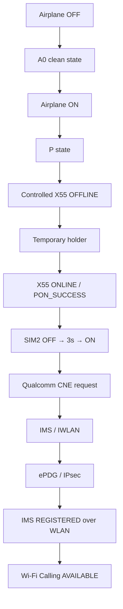
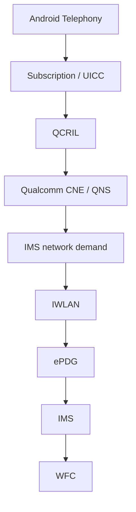

# 📶 VOXI Wi-Fi Calling Recovery

### Xiaomi Mi 10 · Qualcomm X55 · IMS / IWLAN / CNE 无重启恢复研究

一个针对 Android / Qualcomm X55 平台 Wi-Fi Calling 异常的开放研究项目。
目前已经在 **Xiaomi Mi 10（cas）+ Android 13 + VOXI** 环境下，成功实现**无需整机重启**的 Wi-Fi Calling 恢复。

[](docs/GOLDEN_BASELINE.md)
[](docs/CURRENT_STATUS.md)


[](LICENSE)


> **公开状态：`BLOCKED_PRIVACY_HISTORY`**
> 项目文档已按开源协作方式整理，但历史快照仍含持久设备/网络标识。在完成进一步脱敏前，仓库必须保持 private。详见[公开安全审计](docs/PUBLICATION_AUDIT.md)。

## 目录

- [项目简介](#项目简介)
- [当前状态](#-当前状态已成功恢复-wi-fi-calling)
- [最新成功记录](#-最新实机复现)
- [快速开始](#-快速开始)
- [恢复流程](#-恢复流程)
- [工作原理](#-工作原理)
- [已验证结果](#-已验证结果)
- [Golden 与实验版本](#-golden-与实验版本)
- [项目目录](#-项目目录)
- [参与研究](#-欢迎参与研究)
- [安全说明](#-安全说明)
- [License](#license)

## 项目简介

很多 Android Wi-Fi Calling 故障表面上只是“IMS 没注册”，实际可能跨越 Subscription、UICC、QCRIL、Qualcomm CNE、QNS、IWLAN、ePDG 和 X55 modem state。

本项目不是收集几十条 restart 命令碰运气，而是：

- 一次只改变一个变量；
- 同时保存成功、失败和被撤回的假设；
- 用严格 safety gate 和可回滚写操作保护设备；
- 从日志中寻找第一个真正分叉事件；
- 用固定版本、固定流程和重复实验验证恢复边界。

目标不是宣称“所有手机都已解决”，而是公开一套**已经真实成功、可追溯、可继续复现**的 Xiaomi Mi 10 / Qualcomm X55 / VOXI 基线，并继续研究其最小化、泛化和底层机制。

## ✅ 当前状态：已成功恢复 Wi-Fi Calling

| 项目 | 已验证值 |
| --- | --- |
| Golden baseline | `dfd82415073470691295547d39753f6172054748` |
| Result | **PASS**（历史受控重复 6/6） |
| Device | Xiaomi Mi 10 / `cas` |
| Android | 13 |
| ROM | HyperOS `V816.0.4.0.TJJCNXM` |
| Modem | Qualcomm X55 / SDX55M |
| Carrier | VOXI / Vodafone UK · `23415` |
| Recovery | 无需整机 reboot |

最新一次真实成功环境为双卡：

- SIM1：中国大陆运营商卡
- SIM2：VOXI
- VOXI：`slot1` / `phoneId1` / `subId11` / `carrierId28` / `MCCMNC23415`
- Network：Wi-Fi + 英国全局 VPN
- Entry：Airplane mode OFF
- Location spoofing / AnyWhere：**NOT REQUIRED**

Golden baseline 在原测试设备的**单卡和双卡配置**中均观察到成功。这不代表所有设备、ROM、运营商和双卡组合均已验证。

直接成功条件必须同时满足：

1. IMS `REGISTERED(2)`
2. Transport `WLAN(2)`
3. `VOICE/IWLAN AVAILABLE`
4. VOXI direct WFC `AVAILABLE`

CNE request、IMS NetworkAgent、UDP/4500、XFRM/ePDG 是重要 supporting evidence，但不能代替上述直接健康条件。

### 🧪 最新实机复现

| 字段 | 结果 |
| --- | --- |
| Date | 2026-09-26 |
| Golden | `dfd8241` |
| Attempt | 1 / 2 |
| X55 clean shutdown | PASS |
| X55 OFFLINE | PASS |
| X55 ONLINE | PASS |
| New `PON_SUCCESS` | PASS |
| SIM2 software cycle | PASS |
| SIM OFF hold | 3 seconds |
| WFC after SIM ON | ~23 seconds |
| IMS | REGISTERED |
| Transport | WLAN |
| VOICE/IWLAN | AVAILABLE |
| WFC | AVAILABLE |
| Final | `WFC_HEALTHY_FREEZE` |

本次复现中，在受控 X55 重建后执行一次 SIM2 软件 OFF/ON，随后约 23 秒进入完整 WFC HEALTHY 状态。这是该次实验的时序证据，不表示 SIM power cycle 已被证明是唯一原因。

## 🚀 快速开始

### 推荐版本

- Golden commit：`dfd82415073470691295547d39753f6172054748`
- 入口：`experiments/wfc_repeatability_normalization/v262_freeze_run/RUN-X55-WFC-STABLE-v1.cmd`
- Host：Windows PowerShell 5.1

### 已测试运行条件

- Xiaomi Mi 10 / `cas`
- Android 13 / 对应测试 ROM
- Magisk / root
- USB debugging
- Wi-Fi
- 英国全局 VPN
- 启动时 Airplane mode OFF

先以 detached worktree 固定 Golden，不要把最新实验提交误当作稳定版：

```powershell
git fetch --all --tags
git worktree add ..\voxi-wfc-golden dfd82415073470691295547d39753f6172054748
Set-Location ..\voxi-wfc-golden
.\experiments\wfc_repeatability_normalization\v262_freeze_run\RUN-X55-WFC-STABLE-v1.cmd
```

> [!IMPORTANT]
> 历史 Golden core 固定引用 `C:\Users\ZJH\Desktop\platform-tools\adb.exe`。这是冻结版本的环境依赖。为了完整复现 Golden，可以建立兼容路径；**不要修改 `dfd8241` 本身后仍把结果称为 Golden**。

脚本负责以下受控阶段：

`A0 preparation` → `airplane ON` → `P state` → `X55 controlled lifecycle` → `one SIM2 software cycle` → `CNE / IMS / IWLAN rebuild` → `WFC health verification`

运行前必须阅读 [Golden Baseline](docs/GOLDEN_BASELINE.md)、[Experiment Protocol](docs/EXPERIMENT_PROTOCOL.md) 与 [Safety](docs/SAFETY.md)。这不是通用 Android 修复工具。

## 🔄 恢复流程



## 🧩 工作原理



恢复不只是“重启 IMS”。脚本需要先建立可审计的 native/modem lifecycle，再让 Subscription/UICC、CNE/QNS 与 Android framework 在同一个新 epoch 中重新对齐。详细组件边界见 [Architecture](docs/ARCHITECTURE.md)。

## 📊 已验证结果

| 项目 | 当前结果 |
| --- | --- |
| Golden `dfd8241` | ✅ PASS |
| 历史重复测试 | ✅ 6/6 |
| 最新双卡复现 | ✅ PASS |
| 单卡环境 | ✅ Observed working |
| 双卡环境 | ✅ Observed working |
| AnyWhere | ❌ 最新成功不需要 |
| Wi-Fi | ✅ Required in tested setup |
| UK full-tunnel VPN | ✅ Used in latest success |
| 整机 reboot | ✅ Golden recovery 不需要 |
| 简化恢复流程 | 🧪 Research |
| Typed ISub / F8 | 🧪 Research |
| CNE 最小触发链 | 🧪 Research |

失败结果同样有价值：`resetIms(1)`、完整 userspace rebuild、`system_server` restart、RIL-pair 恢复和多个 provider/framework 边界实验都帮助排除了错误方向。完整矩阵见 [Known Results](docs/KNOWN_RESULTS.md)。

## 🏷️ Golden 与实验版本

> [!WARNING]
> **最新提交 ≠ 最稳定版本**

- 🟢 **GOLDEN**：已经有真实重复成功证据；当前公开推荐为 `dfd8241`。
- 🔵 **STABLE**：稳定候选，有受控成功证据但不是 Golden anchor。
- 🟡 **EXPERIMENTAL**：用于验证单一假设，可能失败或写入手机状态。
- ⚪ **PROFILING**：只读采集、解析与性能分析，不代表恢复能力。
- 📚 **HISTORICAL**：历史实验、失败证据或已撤回假设，不作为推荐入口。

所有衍生版本都必须引用基线 commit，并明确列出行为差异。

## 📁 项目目录

| 路径 | 内容 |
| --- | --- |
| `experiments/wfc_repeatability_normalization/` | Golden、稳定性与重复性实验 |
| `experiments/x55_native_handoff/` | X55 ownership / native handoff 研究 |
| `experiments/sim_soft_reset/` | SIM/UICC lifecycle 与 slot mapping |
| `autopilot/` | 状态探针、失败现场和根因分析 |
| `modules/` | Magisk-compatible 模块研究 |
| `golden_state/` | 参考状态采集；不是 Golden source commit |
| `archive/`, `phase*/` | 保留的历史实验与失败证据 |
| `docs/` | 维护中的项目文档 |
| `tools/` | 构建、采集与审计工具 |

重点文档：

- [Golden Baseline](docs/GOLDEN_BASELINE.md)
- [Current Status](docs/CURRENT_STATUS.md)
- [Architecture](docs/ARCHITECTURE.md)
- [Known Results](docs/KNOWN_RESULTS.md)
- [Experiment Protocol](docs/EXPERIMENT_PROTOCOL.md)
- [Research History](docs/RESEARCH_HISTORY.md)
- [Safety](docs/SAFETY.md)
- [Contributing](CONTRIBUTING.md)

## 🤝 欢迎参与研究

如果你有 Qualcomm X55 / X60 / X65 等设备，或者遇到类似 VoWiFi / IMS / IWLAN 问题，欢迎参与复现。**成功结果很重要，失败结果同样重要。**

欢迎贡献：

- 不同 Xiaomi 手机与 Qualcomm modem
- 不同 Android ROM、Vodafone / VOXI 环境及其他运营商
- CNE / QNS、QCRIL、UICC lifecycle 分析
- IMS / IWLAN、ePDG / XFRM 日志
- PowerShell 脚本、安全 gate 和只读诊断工具
- 可复现的失败现场与单变量实验

请优先提交 Issue，而不是直接运行高风险实验脚本。先阅读 [CONTRIBUTING.md](CONTRIBUTING.md)，并使用仓库提供的 Bug、New Device、Experiment Proposal 或 Log Analysis 模板。

## 🧾 提交复现结果

Issue 至少应提供：

- Device / Codename / SoC / Modem
- Android / ROM
- Carrier / MCCMNC / SIM topology
- Root method
- Airplane entry state / Wi-Fi / VPN
- Commit SHA / Script
- Starting state / Result
- 已执行的 phone writes 及次数
- 带时间戳的 redacted logs

提交日志前请删除 **IMEI、IMSI、ICCID、EID、ADB serial、phone number、token、password、account tag、MAC/BSSID、SSID、IP/VPN endpoint 和本地用户名**。历史日志中的 request records 可能是 stale evidence，必须与 current state 分开说明。

## 🛡️ 安全说明

这些脚本可能改变 external modem ownership、SIM/UICC state，并短时中断双卡、蜂窝数据、IMS 和紧急呼叫。只应在完全理解 recovery/rollback 的情况下使用。

- 缺失、冲突或无法解析的字段必须 fail closed。
- 禁止在失败后临时追加第二次 SIM cycle、service restart 或 modem reset。
- 精确 PID、executable、cmdline 与 FD owner 必须匹配。
- UICC disable 流程必须具有有界 TRUE rollback。
- Golden 的成功仅适用于已记录设备/ROM/环境。

本项目与 Xiaomi、Qualcomm、Vodafone 或 VOXI 无官方关联。使用者自行承担风险。

## License

项目代码和文档采用 [Apache License 2.0](LICENSE)。历史日志与第三方 binary artifacts 可能受不同权利约束，重新分发前请核对来源。

---

**English summary:** This repository contains a validated, no-full-reboot VOXI Wi-Fi Calling recovery baseline for a rooted Xiaomi Mi 10 (`cas`) on Android 13 with a Qualcomm X55 modem. The Golden baseline achieved 6/6 historical controlled successes. Support is not claimed for other devices, ROMs, carriers, or SIM configurations.
